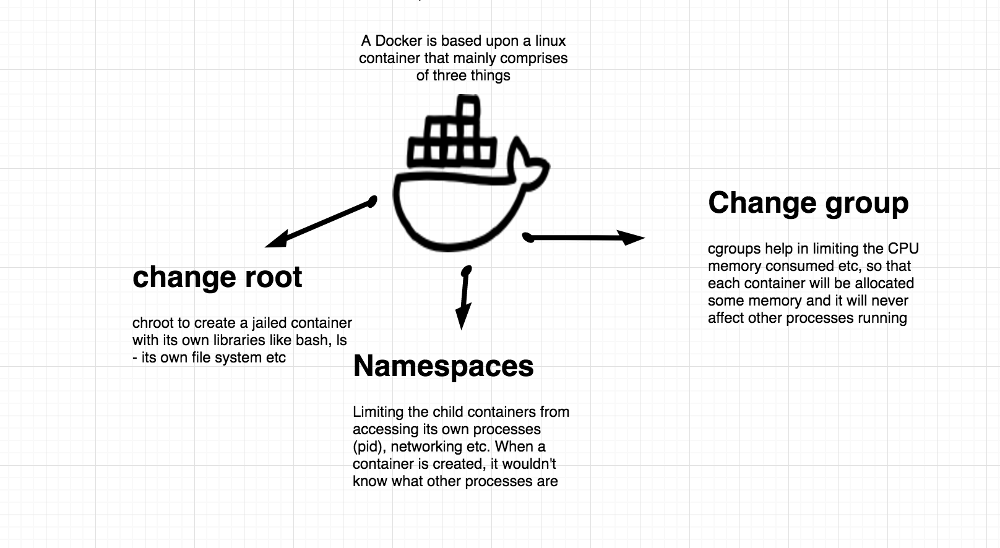

# My Learnings on Dockers

Please Find below my comprehensions on the very useful dockers

## Getting Started

Dockers were made based on linux containers

### Frequently used docker commands

* `docker run -it <container-name>` - runs the container interactively
* `docker run <container-name>` - wouldn't hold on to it
* `docker run <flags> <container-name> <all-commands-to-execute>` - Order matters eg: `docker run -it -rm node ls`
* `docker image prune` - clears up the space, but nest time we need to rebuild everything once we pull
* `docker run -it --detach ubuntu:bionic` - runs the container in the background
* `docker ps` - lists all the running dockers
* `docker attach <container-name>` - attaches it foreground, if we exit, it will kill it
* `docker kill <container-id/name>` - entire instance is killed
* `docker run -it --name my-linux alpine:3.10` - a name to reference it
* `docker logs <container-name>` - gives all the logs 
* `docker rm my-linux` - removes everything regarding this container name , Kill - just kills the process, rm - removes host metadata etc
* `docker run -it --name my-linux -rm alpine:3.10` - on exit it removes the container as well
* `docker run -it node:12-stretch` - 12-stretch is the tag name which is given by author, the version 12 of node in linux-debian stretch
* `docker run -it node` - it indicates node:latest, the latest tag published is pulled from docker hub (its loose ) its always better to mention the exact tag so that it captures the moment of time, so that even after many years, we refer to a specific version to avert any dependency issues
* `docker pull <container-name>` - goes and pulls the image from registry and caches locally
* `docker inspect <container-name>` - gives all info about the container
* `docker pause <container-id>` & `docker unpause <container-id>`
* `docker kill $(docker ps -q)` - kills all containers
* `docker run -dit hollywood` - run spins up a new container, d refers to detached mode
* `docker exec <container-name> ps aux` - exec means tries and finds out existing container and runs commmands against on going executing container
* `docker history <container-name>` - changes in the container over time
* `docker info <container-name>` 
* `docker top <container-id>` - lists all the processes going on in a perticular container
* `docker ps --all` - lists all containers
* `docker container prune` - all the containers are pruned
* `docker image prune` - all the images are pruned
* `docker image list` - lists all images
* `docker restart <container-name>` - node might not respond to restart signal, so it hard restarts it, so it can be slow for some images
* `docker search python` - its a CLI search for dockers on python, we can go to Hub and also search

